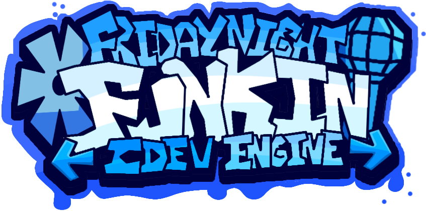

<p align="center">
    
    <h1 align="center">FNF': CDEV Engine - Rewrite</h1>
</p>

<center>
<b><span style="color: #0060FF;">CDEV Engine</span>: <span style="color: #0090FF">Rewrite</span></b>
is a rewritten version of <a href="https://github.com/corecathx/FNF-CDEV-Engine/">Legacy CDEV Engine</a>.
</center>

## 📝 DevNotes
- **Compiling**: CDEV Engine is only designed for **Desktop** and **Mobile** targets.

<hr style="height: 1px">

<details>
    <summary><h2>🖥 Compiling Guide</h2></summary>

### Install Haxe and HaxeFlixel
1. [Install Haxe](https://haxe.org/download/) (recommended to use the latest version of Haxe).
2. [Install HaxeFlixel](https://haxeflixel.com/documentation/install-haxeflixel/).

### Libraries
CDEV Engine uses the following Haxe libraries:
```
[GIT] hscript-improved - https://github.com/FNF-CNE-Devs/hscript-improved.git
```
To install, run `haxelib install <library>` for each library listed above.

For any libraries labeled `[GIT]`, use `haxelib git <library> <link>`.

### Compiling the engine
Simply run `lime test <target>`.
</details>

<details>
    <summary><h2>👥 Credits</h2></summary>
TBA
<!--### CDEV Engine
- [CoreCat](https://corecathx.github.io/) - Main Developer.

### Special Thanks
- [Cobalt](https://github.com/CCobaltDev) - Stylized terminal log.

### Friday Night Funkin'
- [Funkin Crew](https://github.com/FunkinCrew/) - Peak game crew.-->
</details>
