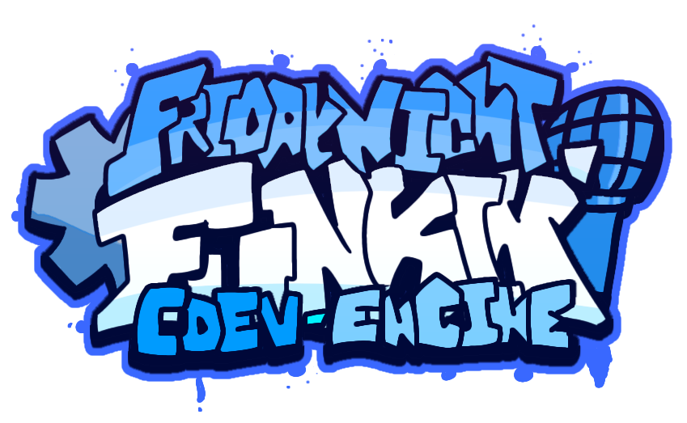

> [!WARNING] 
> As of 03/31/2025, CDEV Engine will be discontinued, and I’ll be changing my focus to other projects unrelated to FNF.
> I’ve lost interest in working on this engine, as I’m more into experimenting with Haxe and general game development now.
> CDEV Engine has been around for four years, and I truly appreciate everyone who has used and supported it, it means a lot to me.
> Regarding the rewritten version of CDEV Engine, that will also be discontinued. Sorry to those who were looking forward to it.
> **Thank you for everything, and sorry for the disappointment.**

<p align="center">
    
    <h1 align="center">Friday Night Funkin': CDEV Engine</h1>
</p>

**CDEV Engine** is a Friday Night Funkin' Engine intended to fix issues with the base game while also adding lot of features, built off **Friday Night Funkin' v0.2.7.1**.

## DevNotes
- **Supported Platforms**: Currently, CDEV Engine is supported only on Windows.
- **Contact**: If you have any issues, feel free to contact me on [Discord](https://discord.com/users/694791036094119996) or join the [CDEV Engine Public Discord Server](https://discord.com/invite/w8sFmXsFpk).
- **Feedback**: All feedback is appreciated, and contributions are welcome!

# Features
- Modding Tools (Character Editor, Stage Editor, and Week Editor)
- Dark Mode (Light mode hurts)
- Custom States (Experimental)
- Support for mid-song events, custom notes/note types, and noteskins
- HScript support
- Entire game UI rework
- Customizable settings (Down/Up Scroll, Ghost Tapping, etc.)
- Song modifiers
- Improved Input System
- Second vocals support
- New chart format (beta) in the Chart Editor

<details>
    <summary><h2>Compiling Guide</h2></summary>

## Installing requirements

> If you're here to make mods without using the built-in modding support, download the source code from the [Releases](https://github.com/Core5570RYT/FNF-CDEV-Engine/releases/latest) section first.

### Step 1: Install Haxe and HaxeFlixel
1. [Install Haxe 4.2.5](https://haxe.org/download/version/4.2.5/) (Newer versions cause issues when compiling).
2. [Install HaxeFlixel](https://haxeflixel.com/documentation/install-haxeflixel/).

### Step 2: Install Additional Libraries
Check `Project.xml` in the project root for an updated list of required libraries. Install each library with:
```bash
haxelib install [library]
```

Required Libraries:

- flixel
- flixel-addons
- flixel-ui
- hscript
- hxCodec
- extension-androidtools
- HxWebView

For example: `haxelib install newgrounds`.

Git Libraries:

- Download [git-scm](https://git-scm.com/downloads).
- Install the application.
- Run the following commands to install Git libraries:
- `haxelib git discord_rpc https://github.com/Aidan63/linc_discord-rpc`
- `haxelib git flxanimate https://github.com/Dot-Stuff/flxanimate.git`

You should have everything ready for compiling the engine! Follow the guide below to continue!

## Compiling the engine
- Install Visual Studio Community.
- In "Individual Components" tab, select:
- - MSVC v143 - VS 2019 C++ x64/x86 build tools
- - Windows SDK (10.0.17763.0)

Run the following command to build & test the engine:

```bash
lime test windows
```

Or use the following command to debug the engine:
```bash
lime test windows -debug
```

Your compiled version of the engine will be located in the `export` folder in the project root.

Now you know how to build the engine, enjoy!
</details>

<details>
    <summary>
        <h2>Modding Documentation</h2>
    </summary>

If you prefer not to modify source codes, consider using the built-in modding feature. Read the [Documentation](https://corecathx.github.io/FNF-CDEV-Engine/) to understand how it works.

</details>

<details>
    <summary>
        <h2>Credits</h2>
    </summary>
CDEV Engine

- [CoreDev](https://twitter.com/core5570r) - Programmer of this engine, additional assets.

Special Thanks

- [PolybiusProxy](https://github.com/polybiusproxy) - MP4 Video Haxe Library (hxCodec).
- [SanicBTW](https://github.com/SanicBTW) - HxWebView Library.
- [CobaltBar](https://github.com/CobaltBar) - Colored Traces in terminal (game/cdev/log/Log.hx).

Engines that inspired CDEV Engine & Codes used in this engine

- [Codename Engine](https://github.com/FNF-CNE-Devs/CodenameEngine) - GPU Bitmap code.
- [Psych Engine](https://github.com/ShadowMario/FNF-PsychEngine) - Literally inspired CDEV Engine to have Modding Supports, and Chart Editor Waveform code.

Funkin' Crew

- [ninjamuffin99](https://twitter.com/ninja_muffin99) - Programmer
- [PhantomArcade3K](https://twitter.com/phantomarcade3k) - Art
- [Evilsk8r](https://twitter.com/evilsk8r) - Art
- [KawaiSprite](https://twitter.com/kawaisprite) - Musician
</details>

